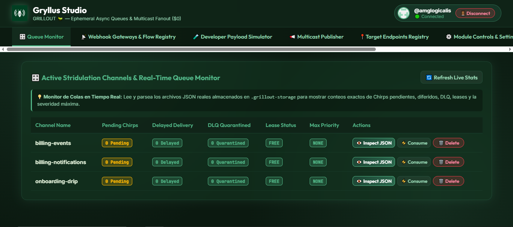

# 🦗 GRILLOUT (`grillout`)

<div align="center">
  
  <h1>Gryllus Studio — GRILLOUT Engine</h1>
  <p><strong>Ephemeral Async Queues, Multicast Stridulation & Zero-Cost Notification Fanout ($0 Infrastructure)</strong></p>

  [](https://www.npmjs.com/package/grillout)
  [](LICENSE)
  [](https://github.com/amglogicalis/Terra)
  []()
</div>

---

## 🌐 Live Interactive Web Console

Experience the full power of Gryllus Studio directly in your browser:

👉 **[Launch Live Online Web Console](https://amglogicalis.github.io/grillout-repo-public/)**

<div align="center">
  
</div>

---

## 🌟 Key Modules & Core Features

### 🎛️ 1. Active Stridulation Channels & Real-Time Queue Monitor
- Real-time metrics parsing directly from `.grillout-storage` vault files.
- Track pending Chirps, delayed deliveries, leases, DLQ quarantines, and max priority.
- **⚡ Live 1-Click Batch Consume**: Execute queue consumption and dispatch fanout in real-time.
- **👁️ Live Inspect JSON**: Query live queue JSON payloads and audit trails directly via GitHub REST API.
- **🗑️ Delete Queue**: Purge temporary queue files with one click.

### 📡 2. Webhook Gateways & End-to-End Flow Registry
Configurable **3-Phase Pipeline Architecture**:
1. **📥 Authorized Origins**: Accumulate inputs from microservices (Sinchlor, Rolla, Stripe, GitHub, Webbl).
2. **🛡️ Security & Filter Rules**: HMAC SHA-256 signature verification & JavaScript expression rules (e.g. `payload.amount > 50`).
3. **📢 Multicast Fanout**: Route incoming webhooks to multiple target channels automatically.
- Dedicated glassmorphic modal popup for editing and channel renaming with collision protection.

### 🧪 3. Developer Webhook Inspector & Live Expression Simulator
- Test incoming raw JSON payloads from Stripe, GitHub, or custom services.
- Evaluate filter expression rules and subject mapping expressions in real time before going to production.

### 📢 4. Multicast Chirp Publisher
- Dispatch single notifications simultaneously to **Discord**, **Slack**, **Telegram**, **Custom Webhooks**, **Email**, and **GitHub Issues**.
- Supports **FIFO GroupKeys** for strict chronological sequential ordering per resource/user.
- Priority tiers: `CRITICAL`, `VIP`, `NORMAL`, and `LOW`.

### 📍 5. Destination Endpoints & Target Registry
- Central manager for webhook URLs, bot tokens, and email recipients.
- Reusable destination aliases to simplify multi-channel publishing.

### ⚙️ 6. Module Controls & Security Shields
- **🛡️ HoneyChirp PoisonShield**: Passive anti-bot shield that quarantines XSS, SQLi, and malicious command payloads before consuming runners.
- **🎯 Gryllus SHA-256 Deduplicator**: Prevents duplicate notification processing within a configurable window (default 300s).

### 🎨 7. Gryllus Template Synthesizer
- Integrated HTML & Markdown template engine with dynamic variable substitution `{{variable}}`.
- **Zoom Controls**: Scale preview from `50%` to `200%`.
- **Device View Presets**: Instantly switch between `📱 Mobile (375px)` and `💻 Desktop (100%)`.
- **Vertical Scroll Range Slider**: Smooth vertical scrolling for tall templates.
- **📁 File Loader & 📦 Native Drag & Drop**: Drag `.html`, `.md`, or `.txt` files directly onto the editor to load code instantly.

### 🔄 8. Dead-Letter Queue (DLQ) & Forensic Replay
- Inspect failed or quarantined Chirps with full error tracebacks.
- **1-Click Replay**: Re-enqueue historical or quarantined messages cleanly.

---

## ⚡ Global CLI Tool Usage

Install globally via npm or run instantly using `npx`:

```bash
npm install -g grillout
```

### CLI Command Reference

```bash
# 🎛️ Queue Management
grillout queue list                            # List all active queues & live stats
grillout queue consume --channel <name>        # Consume pending batch live in queue
grillout queue delete --channel <name>         # Delete queue and DLQ files
grillout queue inspect --channel <name>        # Inspect raw JSON content of queue

# 📡 Webhook Gateways
grillout gateway list                          # List registered Webhook Gateways
grillout gateway create --channel <name> [opts]# Create new Webhook Gateway
grillout gateway edit --channel <name> [opts]  # Edit or rename Webhook Gateway
grillout gateway delete --channel <name>       # Delete Webhook Gateway
grillout gateway seed                          # Seed 3 demo Webhook Gateways

# 📍 Target Endpoints Registry
grillout target list                           # List registered Target Endpoints
grillout target add --alias <n> --endpoint <u> # Add destination Target Endpoint
grillout target delete --alias <name>          # Delete Target Endpoint
grillout target seed                           # Seed 6 demo Target Endpoints

# 📢 Chirps & Multicast Dispatch
grillout chirp publish --channel <n> [opts]    # Publish Multicast Chirp
grillout chirp replay --channel <n> --id <id>  # 1-Click Replay quarantined Chirp

# 🧪 Developer Simulator & Templates
grillout simulator run --payload <json> [opts] # Run live expression filter simulation
grillout template render --file <path> [opts]  # Render HTML/Markdown template
```

---

## 📦 Node.js / TypeScript SDK Usage

Install in your Node.js or TypeScript project:

```bash
npm install grillout
```

### Programmatic Code Example

```typescript
import { Grillout } from 'grillout';

const grillout = new Grillout({
  githubToken: process.env.GRILLOUT_PAT,
  poisonShieldEnabled: true,
  defaultDedupWindowSec: 300
});

// 1. Publish a Multicast Chirp
const res = await grillout.publish({
  channel: 'billing-events',
  payload: {
    amount: 150.00,
    status: 'succeeded',
    customer: 'user@terra.io'
  },
  priority: 'CRITICAL',
  groupKey: 'user_99',
  targets: [
    { type: 'discord', endpoint: 'https://discord.com/api/webhooks/...' },
    { type: 'slack', endpoint: 'https://hooks.slack.com/services/...' }
  ]
});

console.log('Chirp published:', res.chirp.id);

// 2. Consume live batch
const consumed = await grillout.consumeQueue('billing-events');
console.log(`Delivered ${consumed.deliveredCount} chirps.`);

// 3. Evaluate filter expression programmatically
const sim = grillout.runSimulation(
  { amount: 150, status: 'succeeded' },
  "payload.amount >= 50 && payload.status == 'succeeded'"
);

console.log('Simulation verdict:', sim.status);
```

---

## 🛡️ Security & Privacy Architecture

- **Zero Credential Leaks**: GRILLOUT does not store or hardcode tokens.
- Authentication credentials (`GRILLOUT_PAT`, `GITHUB_TOKEN`) are read exclusively at runtime from your environment variables or command flags.
- All network operations communicate over HTTPS via GitHub REST API.

---

## 📄 License

MIT © **Terra Ecosystem** — Built with $0 marginal infrastructure.
